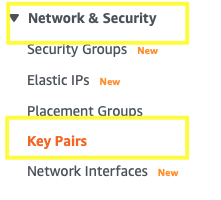
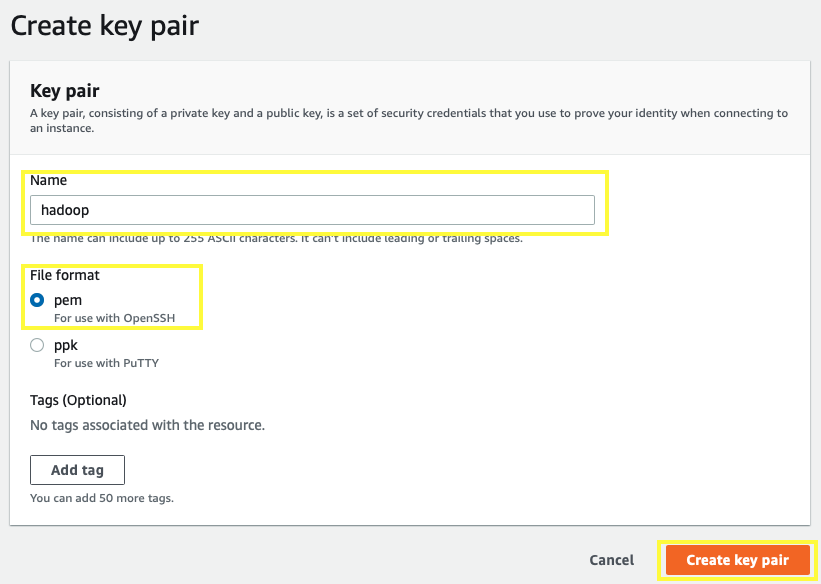
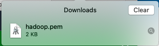

# Generating AWS PEM Key file

One of ways AWS provides to enable access to an EC2 is with the use of a [PEM Key](https://en.wikipedia.org/wiki/Privacy-Enhanced_Mail). So, first step when configuring a fresh account is to generate a PEM file for further access to EC2 servers created under the account.

1. Go to www.aws.amazon.com and click ***Sign In to the Console***:<p>


2. Once logged in, type ***EC2*** on the search bar and then select the ***EC2*** service from the list:<p>


3. On the right panel of ***EC2 console***, search for ***Key Pairs*** under ***Network & Security*** section:<p>


4. On the ***Key pairs*** page, click on ***Create key pair*** button:<p>


5. Give your PEM Key a name, select ***pem*** as file format and then click on ***Create key pair*** button:<p>

    
    Once you click, it will download the PEM Key file to your machine:<p>
    

6. You won't be able to use the PEM file unless you restrict its security. In order to do so, run the following statement on the your computer terminal:<p>
    ```bash
    chmod 600 ~/Downloads/hadoop.pem 
    ```

Your PEM Key is now ready for use!