# Creating an AWS EC2 instance

1. Go to www.aws.amazon.com and click ***Sign In to the Console***:

2. Once logged in, type ***EC2*** on the search bar and then select the ***EC2*** service from the list:

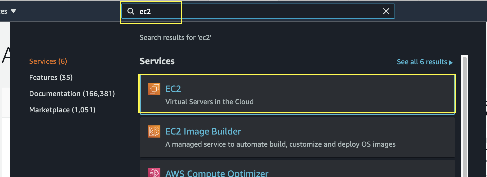

3. On the right panel of ***EC2 console***, search for ***Key Pairs*** under ***Network & Security*** section:

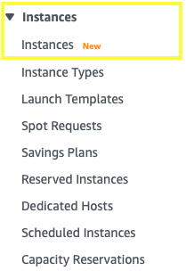

4. On ***EC2 console*** click on ***Launch Instances*** button:

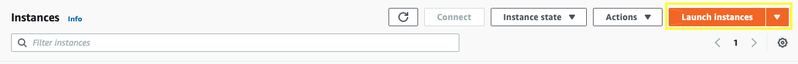

5. On the search bar, type *ubuntu* and hit ***enter***. Then select the instance (we are using Ubuntu Server 18) and click on ***Select*** button close to it:

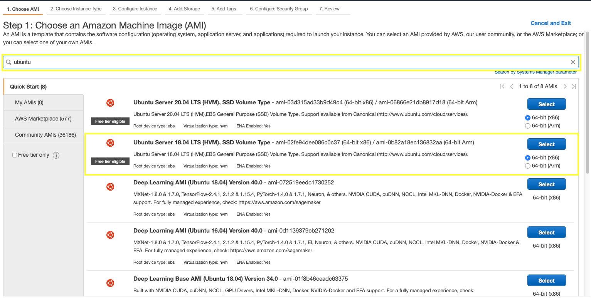

6. Choose the instance type (we are using the one eligible for free tier) and then click on ***Next: Configure Instance Details*** button

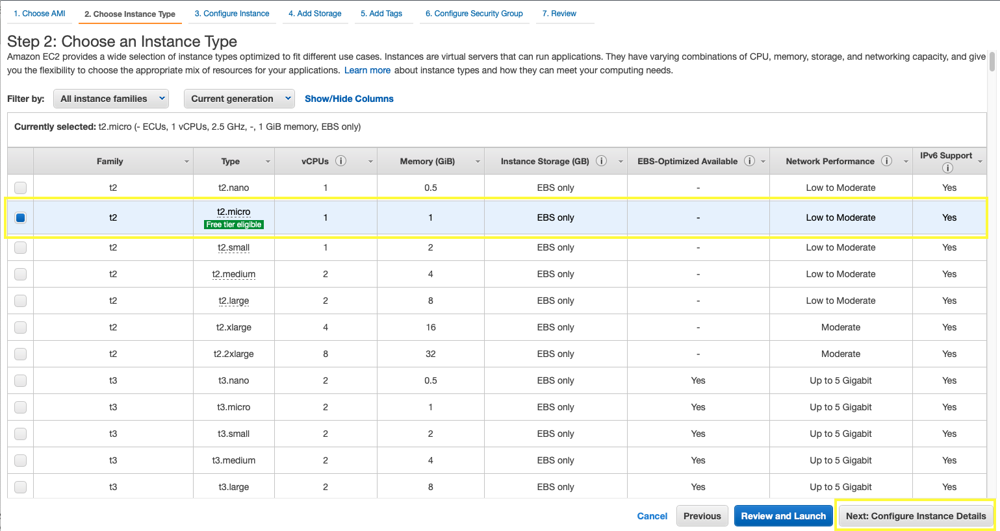

7. You can select the number of instances with the same configuration to be privisioned at once. In our case, we are going to leave *1*. You can also leave everything else as it is (unless you want to explore some options =) ). Click on ***Next: Add Storage*** button:

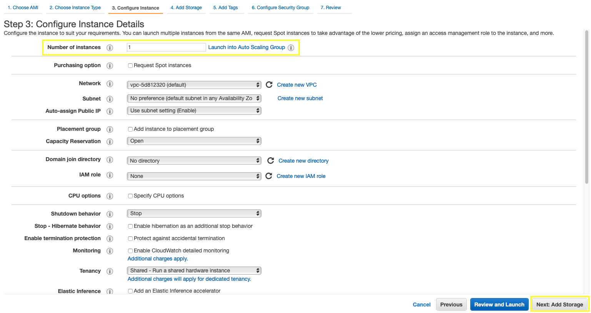

8. You can add as many disk as you want (limited by the type of instance chosen), as well the size of each one (according to the limits of the volume type). In order to keep our instance on free tier, we will add the maximum allowed to it: 30 Gb (General Purpose SSD). Click on ***Next: Add Tags***:

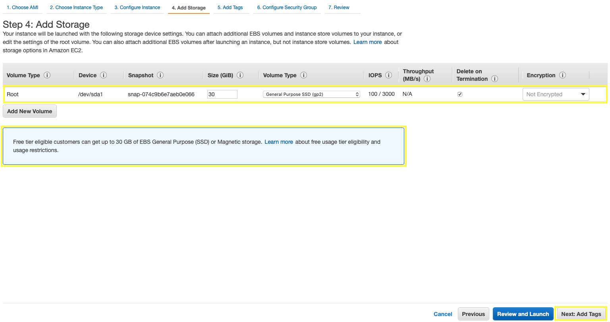

9. Tags key-value pairs are a nice way of providing information about your resources under AWS. It also enables you to search or filter easily. For this specific case, we are just going to add ***Name*** tag with *Hadoop Template Instance* value and click ***Next: Configure Security Group***:

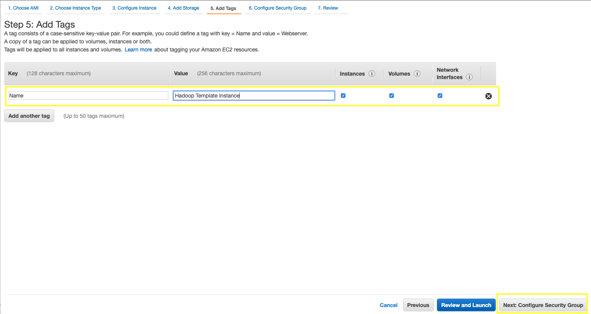

10. Now select the security groups. First, select the ***Select an existing security group*** radio button

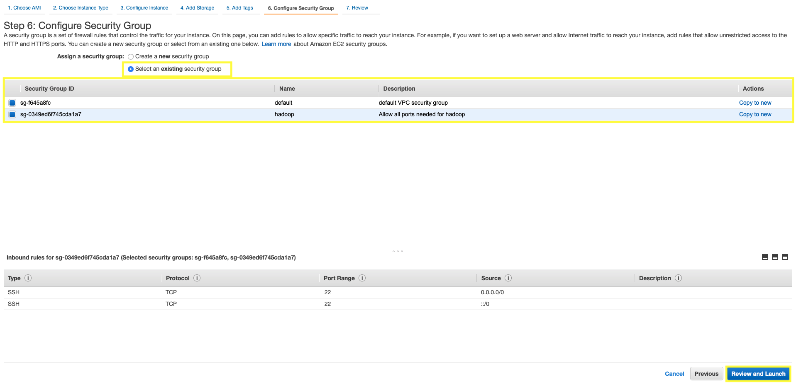
    **Notes**:
    * If you want to create your groups, please, check [How-to create an EC Security Group](create_ec2_security_group.md)
    * Default security group allows every IP and port inside the boundaries of the VPC 

11. You can now review all the parameters for the new instance to be provisioned. If there is anything to be change, you can go back to the specific page by clicking on the links at the top of page. if no, just click on ***Launch*** button:

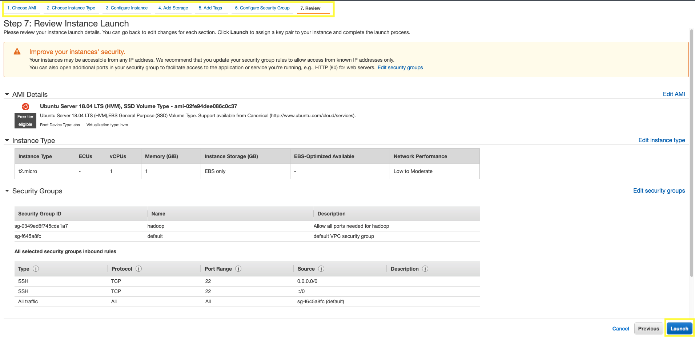

12. A page will pop up asking you to select the key pair. You should also acknowledge that you are aware that without the key you won't be able to get access to the server. Then just click on ***Launch Instances***:

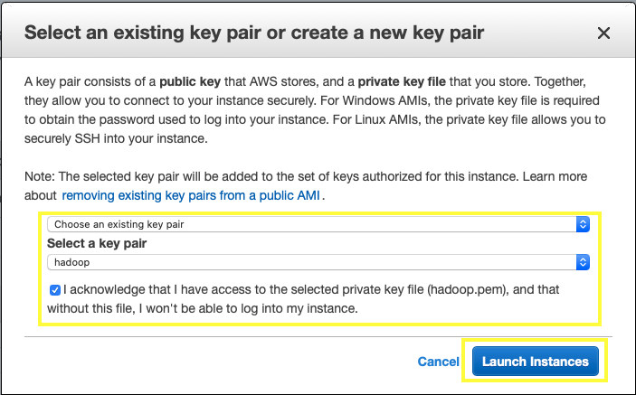

13. You can get back to the ***EC2 console*** to check the progress of your new server provisioning:

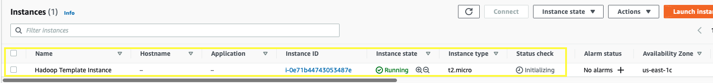

14. The provisioning completion is indicated by two columns: ***Instance state***, that indicates that it is running, and the ***Status check***. If both are green, you're good. By selecting the instance, you can also get its ***Public IPv4 address*** (the one you will use to get access to it from anywhere outside its VPC) and the ***Private IPv4 addresses***, (the one to be used for communication inside the VPC boundaries):

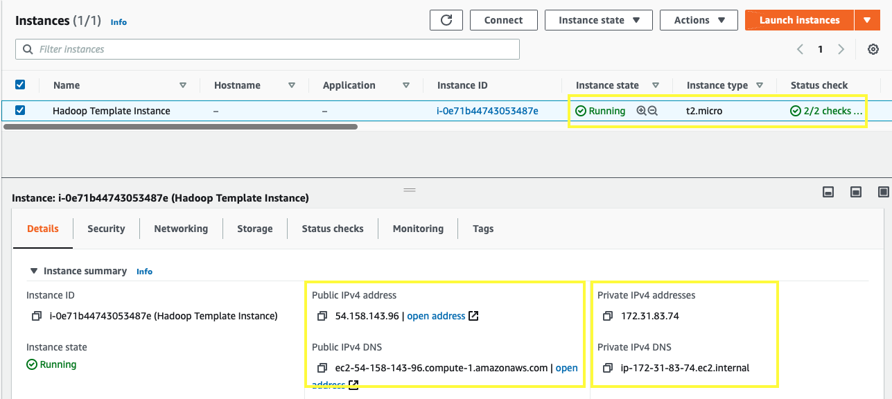
